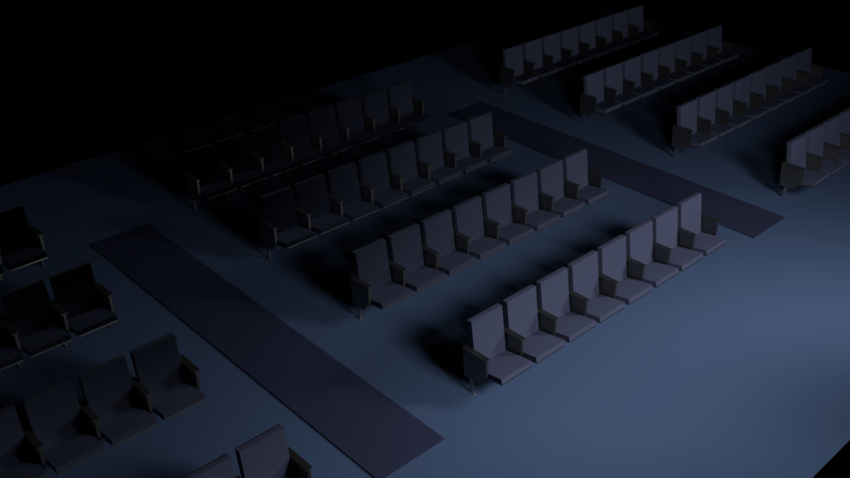
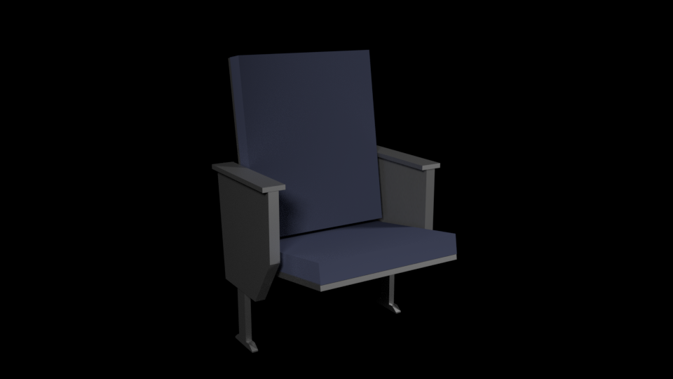
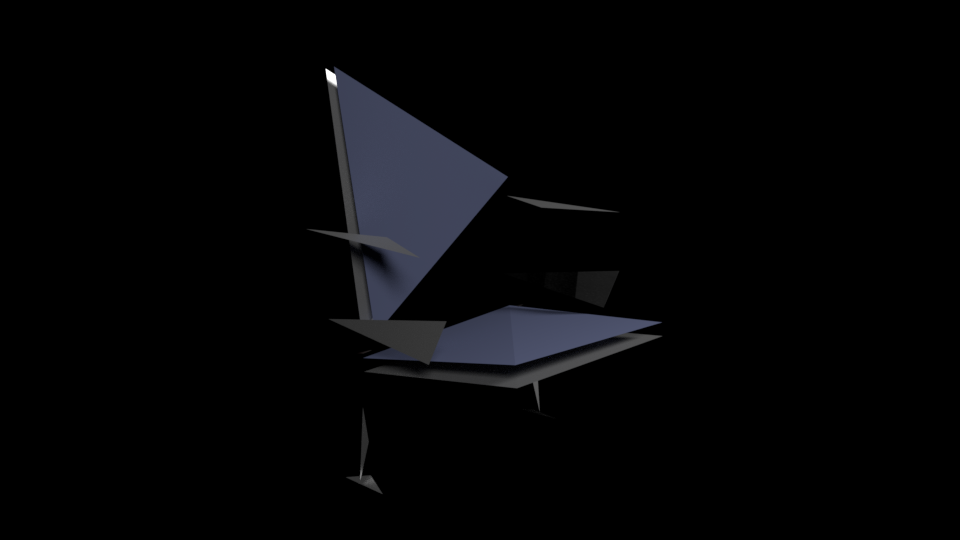

# chairs-model

Low poly chair models for a stage scene I'm working on. For more renderings, check out the `/progress` folder. 

### Scene

===

### Individual chair

===

### Individual chair (abstract)

